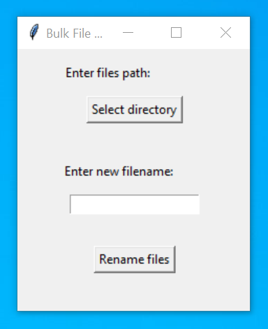

# Bulk File Renamer

This is a handy bulk file renamer with GUI made using Tkinter that allows you to choose a folder containing files to be renamed and the prefix that each file will get before its number.

 

  

